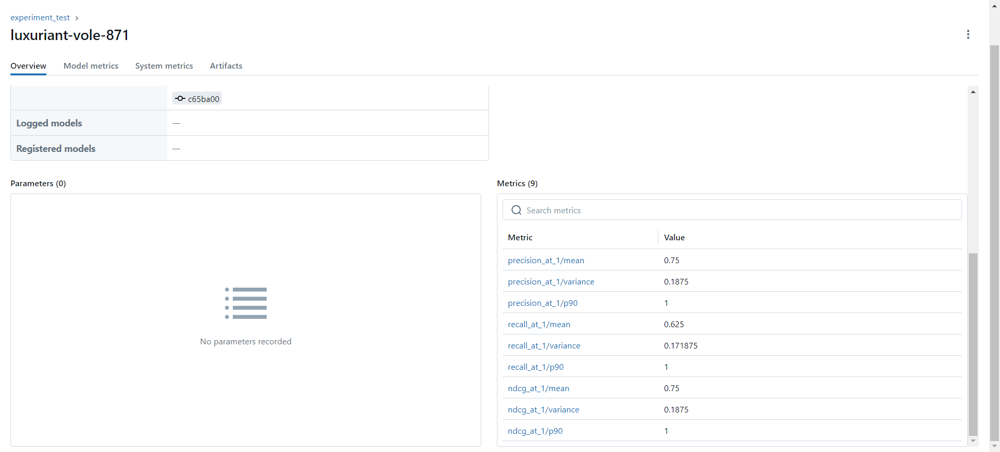

# llm-recommendation-system-with-rag

## 실행 방법
### Dev Run
```
docker-compose -f docker-compose.yml --env-file .env.dev up -d
```
### Dev Stop
```
docker-compose -f docker-compose.yml --env-file .env.dev down
```

### Local Run
```
main.py --env local
```

## 검색 평가
검색 평가를 위해 questions, ground_truth_context, retrieved_context 데이터가 필요하다.
참고: https://mlflow.org/docs/latest/llms/rag/notebooks/retriever-evaluation-tutorial.html

### mterics


```python
import pandas as pd
import mlflow

if __name__ == "__main__":
    data = pd.DataFrame(
        {
            "questions": [
                "장예모 감독의 영화를 추천해주세요.",
                "이경규 감독의 작품 중 추천해주실 만한 게 있을까요?",
                "장훈 감독의 작품 중 한 편을 추천해주세요.",
                "조스톤 테니 감독의 영화 중 추천해주실 만한 작품이 있을까요?",
                "조쉬 더하멜 감독이 만든 영화 중 추천해주실 만한 것이 있을까요?"
            ],
            "ground_truth_context": [
                ["2035", "2121", "4142", "4219", "10479", "11389", "12339", "15040", "16506", "27323", "29911", "40288", "41857", "42699", "44442", "60283", "64159", "64426", "85585", "92720", "117050", "128451", "150720", "167388"],
                ["11354"],
                ["2703", "45941", "50265", "55937", "95143", "100237"],
                ["130646"],
                ["151371"]
            ],
            "retrieved_context": [
                ["2035", "2121"],
                ["11354"],
                ["2703", "45941"],
                ["130646"],
                ["151371"]
            ]   
        }
    )
    top_k = 2
    mlflow.set_tracking_uri({mlflow tracking 서버 IP})
    mlflow.set_experiment({experiment 이름})
    with mlflow.start_run() as run:
        evaluate_results = mlflow.evaluate(
            data=data,
            model_type="retriever",
            targets="ground_truth_context",
            predictions="retrieved_context",
            evaluators="default",
            evaluator_config={"retriever_k": top_k}
        )

```

## 평가 결과 확인



### 📖 참고 글
[Book Recommendation using Retrieval Augmented Generation][link1]
| Book title, Genres, Description 데이터로 임베딩 진행

[MovieGPT: A Gen AI Movie Recommender][link2]
| 위키피디아로 영화 데이터 활용

[Transforming Retail with RAG: The Future of Personalized Shopping][link3]
| 개인화 상품 추천 RAG with rerank

[A Real-time Retrieval System for RAG on Social Media Data][link4]
| rerank에 cross encoder 적용

[Search, Rank, and Recommendations][link5]
| 유저 데이터로 rerank 대상 추가


[link1]: <https://medium.com/@mrunmayee.dhapre/book-recommendation-using-retrieval-augmented-generation-52965b71ed16>
[link2]: <https://github.com/rafaelpierre/moviegpt/blob/main/README.md>
[link3]: <https://eduand-alvarez.medium.com/transforming-retail-with-rag-the-future-of-personalized-shopping-1ac0565d98ed>
[link4]: <https://medium.com/decodingml/a-real-time-retrieval-system-for-rag-on-social-media-data-9cc01d50a2a0>
[link5]: <https://subirverma.medium.com/search-rank-and-recommendations-35cc717772cb>
